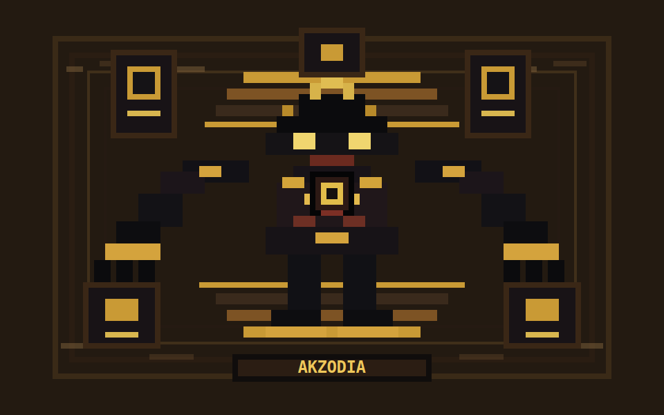

# Akzodia

Akzodia 是一个“书籍 skill 组装体”。



它的隐喻来自游戏王里通过不同部件集齐完整存在的角色：每一本书、每一种理论、每一个方法论都不是单独摆放的知识卡片，而是智能体编排系统身体上的一个部件。把这些部件组合起来，才形成一个能理解任务、执行流程、调度资源、观察世界、恢复失败、复用经验、审查知识本身的 agent orchestration 知识体。

配图是项目内原创像素风 Akzodia 图腾，用来表达“部件集齐后形成完整智能体身体”的隐喻；不引用第三方角色截图或外部素材。

这个项目关心的不只是“知识”，还包括：

- `知识`: 系统论、控制论、调度、分布式、SRE、知识表示等可直接使用的方法。
- `知识的知识`: 什么时候该调用哪种知识，如何区分相邻理论，如何判断一个方法是否适用。
- `元知识`: 如何表示知识、验证知识、迁移知识、审计知识来源，以及如何让 skill 自我进化而不退化成通用模板。

## Core Metaphor

Akzodia 把 52 个 book-derived skills 组织成一个智能体编排身体：

| 部件 | Skill 范围 | 编排含义 |
|---|---:|---|
| 头部 / Head | `01-11` | 识别问题、定义边界、拆解任务、建模目标、选择规划与优化方式。 |
| 左手 / Left Arm | `12-16` | 操作流程、状态、事务和合法执行轨迹。 |
| 右手 / Right Arm | `17-21` | 调度资源、处理并发、排队、通信和优化。 |
| 左脚 / Left Leg | `22-25` | 记录、追踪、回放、观测、验证，让系统知道自己走过哪里。 |
| 右脚 / Right Leg | `26-32` | 分布式运行、可靠性、恢复、幂等和补偿，让系统跌倒后还能继续。 |
| 躯干 / Control Core | `33-40` | 控制反馈、自适应、自治、意图、多智能体协调。 |
| 感官 / Senses | `41-43` | 信息、检测、估计、监控和可观测性。 |
| 记忆 / Memory | `44-47` | 知识工程、案例复用、过程经验、检索增强生成。 |
| 元知识冠层 / Meta-Knowledge Crown | `48-52` | Sowa 概念图、知识表示、本体、标准史、数学逻辑背景，用来审查知识如何被表示、翻译和证明。 |

详细部件映射见 [references/akzodia-parts-map.md](references/akzodia-parts-map.md)。

## What A Skill Is

这里的 skill 不是书摘，也不是“懂一点理论”的提示词。

每个 skill 都要从原书或原理论里抽出四层东西：

- `核心框架`: 这本书最不可替代的对象、关系、结构和判断语言。
- `发现方法`: 它如何发现问题、错误、瓶颈、冲突、缺口或隐藏结构。
- `编排转译`: 它如何变成智能体编排中的决策、路由、恢复、验证或记忆机制。
- `边界条件`: 什么时候不能用，什么时候应该交给相邻部件。

因此，Akzodia 的目标不是“让模型知道更多名词”，而是让模型在编排过程中能判断：

- 当前问题是哪一个身体部件的问题？
- 应该使用哪种理论的发现方法？
- 输出什么 artifact 才算真正应用了该理论？
- 这个判断有没有越界、误用、伪精确或缺少证据？

## Repository Layout

```text
Akzodia/
├── README.md
├── assets/
│   └── akzodia/
│       └── akzodia-pixel-avatar.svg
├── checklist.md
├── manifest.json
├── references/
│   ├── akzodia-parts-map.md
│   ├── book-derived-essence-index.md
│   └── source-manifest.md
└── skills/
    └── <skill-name>/
        ├── SKILL.md
        ├── audit.json
        ├── test-prompts.json
        └── references/
            └── source-notes.md
```

`SKILL.md` 是运行入口。`references/source-notes.md` 保存本地来源胶囊和书籍上下文，不要求运行时访问原书、网页、本机抓取路径或仓库外文件。

## The 52 Parts

完整清单见 [checklist.md](checklist.md)。粗略分组如下：

- `01-11`: 结构设计、任务拆解、规划、本体、运筹优化。
- `12-16`: 工作流、BPM、Petri 网、状态机、事务处理。
- `17-21`: 调度、排队、Actor、CSP、凸优化。
- `22-25`: 事件溯源、过程挖掘、可观测性、模型检测。
- `26-32`: 分布式系统、恢复、数据密集型系统、SRE、幂等、Saga。
- `33-40`: 控制论、必需多样性、工程控制论、MAPE-K、VSM、BDI、多智能体。
- `41-47`: 信息论、检测估计、监控、知识工程、案例推理、RAG。
- `48-52`: Sowa 概念图、知识表示、本体工程、计算机标准史、数学逻辑背景。

## How To Use

把需要的 skill 目录复制到 Codex skills 路径，或让 agent runtime 直接读取对应的 `SKILL.md`。

示例：

```text
skills/35-engineering-cybernetics/SKILL.md
skills/48-sowa-conceptual-graphs/SKILL.md
skills/50-sowa-ontology-engineering/SKILL.md
```

调用时先定位部件：

- 问题是边界和拆解不清？先看 `Head`。
- 问题是流程执行、状态和事务？看 `Left Arm`。
- 问题是并发、资源、排队、优化？看 `Right Arm`。
- 问题是没有记录、无法回放、无法验证？看 `Left Leg`。
- 问题是失败恢复、幂等、分布式可靠性？看 `Right Leg`。
- 问题是反馈、自适应、控制稳定性？看 `Control Core`。
- 问题是信号、检测、估计、监控？看 `Senses`。
- 问题是经验复用、知识获取、RAG？看 `Memory`。
- 问题是知识如何表示、翻译、证明、分类？看 `Meta-Knowledge Crown`。

## Closure Policy

Akzodia 的 skills 必须是可携带、可审计、可离线执行的：

- 不把本机路径、网页 URL、抓取目录、原书镜像路径写成运行时依赖。
- 需要保留的来源知识会压缩进 `SKILL.md` 或 `references/source-notes.md`。
- `manifest.json` 和 `audit.json` 只指向 skill-local references。
- 如果某个 skill 必须依赖外部资料才能运行，它就没有完成闭环。

## Evolution Rule

后续用 Darwin 或其它演化流程优化时，不能只让 skill 变得“更完整”或“更通用”。一次有效演化必须让某个部件更像它自己：

- Head 要更会定义边界和任务结构。
- Arms 要更会执行、调度、操作状态。
- Legs 要更会追踪、回放、恢复、续跑。
- Core 要更会反馈、调节、稳定和自适应。
- Senses 要更会选择信号、降低不确定性。
- Memory 要更会获取、组织、复用经验。
- Meta-Knowledge Crown 要更会审查知识的表示、语义、证明和迁移。

如果一次更新无法说清“这个部件多发现了什么”，它就不是 Akzodia 的进化。
