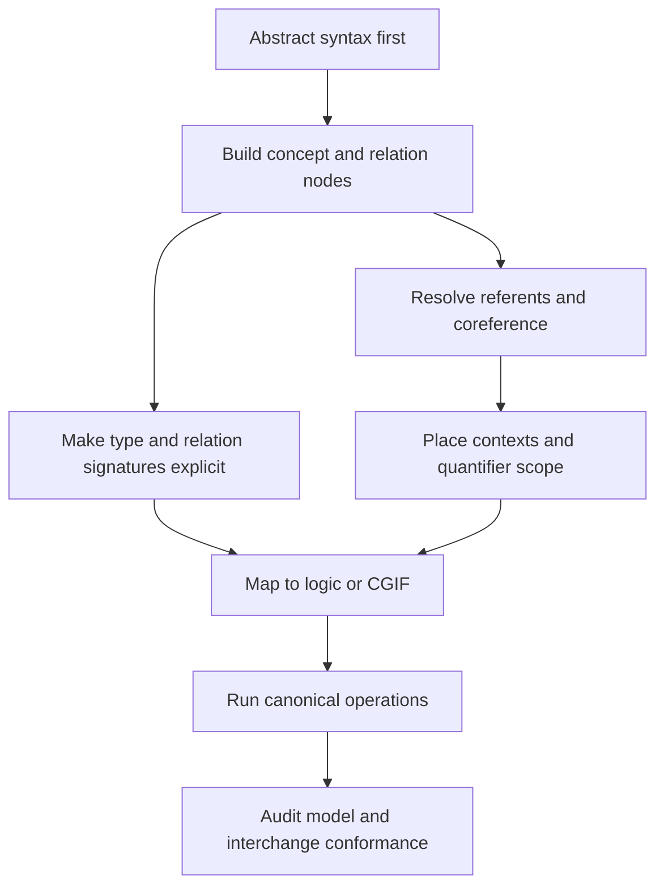

# Index: 48-sowa-conceptual-graphs

## Output Unit

- `SKILL.md`: executable Codex skill for using Sowa-style conceptual graphs in knowledge representation, logical mapping, graph operations, interchange formatting, and modeling audits.
- `test-prompts.json`: trigger, non-trigger, and edge-case prompts.
- `audit.json`: source and quality audit.
- `BOOK_OVERVIEW.md`: stage 0 Adler reading.
- `candidates/`: extractor-style candidate pool.
- `rejected/`: candidates not promoted to standalone skills.

## Closure Notes

The skill is intended to run without re-reading the source book. `SKILL.md` now includes a standalone contract, machine-checkable gates, failure-mode recovery, and output formats for modeling, CGIF, logic mapping, audits, and canonical-operation comparisons.

The source files remain traceability anchors. They should be consulted only for exact quotations, attribution, standards/procurement/legal questions, or disputed details that affect a compliance claim.

## Source Map

Primary source files:

- `references/source-notes.md`
- `references/source-notes.md`
- `references/source-notes.md`
- `references/source-notes.md`
- `references/source-notes.md`
- `references/source-notes.md`
- `references/source-notes.md`
- `references/source-notes.md`
- `references/source-notes.md`
- `references/source-notes.md`

Original local HTML consulted:

- `references/source-notes.md`
- `references/source-notes.md`
- `references/source-notes.md`
- `references/source-notes.md`
- `references/source-notes.md`
- `references/source-notes.md`

## Candidate Dependency Graph

## Why One Skill

The candidate units are tightly coupled. A CGIF serialization check is unreliable without coreference and context checks; graph operations depend on type hierarchy and relation signatures; logical mapping depends on quantifier scope and the core/extended CG distinction. One integrated skill gives the agent a usable execution path instead of a fragmented summary.

## Compliance Coverage

`test-prompts.json` covers:

- should-trigger modeling, CGIF serialization, Common Logic mapping, predicate-calculus mapping, canonical operations, CGIF audits, and standalone execution.
- should-not-trigger history, visualization, current ISO price lookup, Mermaid conversion, biography, graph database implementation, and visual styling.
- edge cases for non-formal knowledge graphs, ISO-only modality requests, RDF/OWL boundary handling, uncertain identity joins, Cypher-only prompts, CGIF repair, quantifier scope, negative-context operation direction, and extension warnings.
