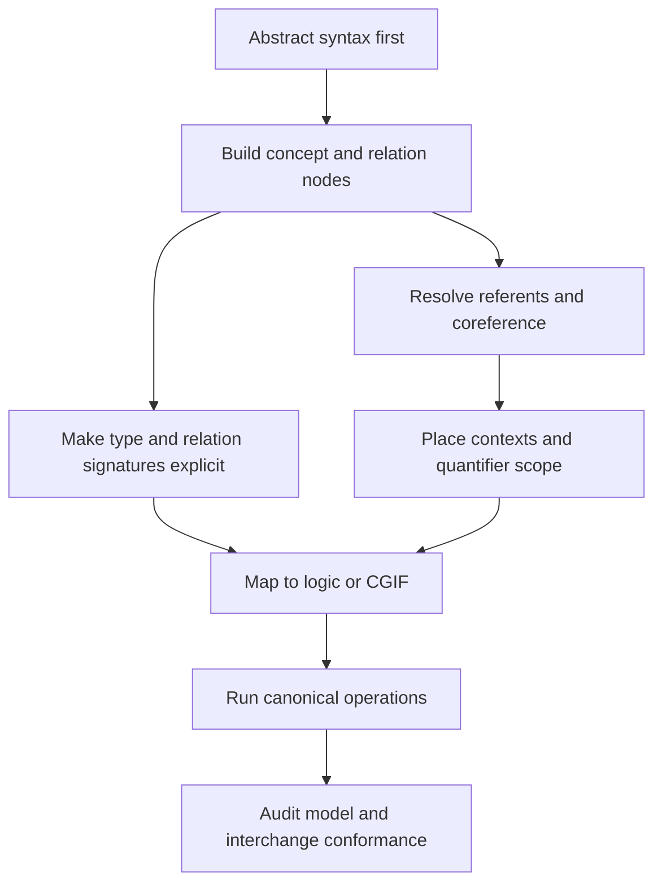

# Index: 48-sowa-conceptual-graphs

## Output Unit

- `SKILL.md`: executable Codex skill for using Sowa-style conceptual graphs in knowledge representation, logical mapping, graph operations, interchange formatting, and modeling audits.
- `test-prompts.json`: trigger, non-trigger, and edge-case prompts.
- `audit.json`: source and quality audit.
- `BOOK_OVERVIEW.md`: stage 0 Adler reading.
- `candidates/`: extractor-style candidate pool.
- `rejected/`: candidates not promoted to standalone skills.

## Source Map

Primary source files:

- `site-sowa/books/conceptual-graphs/BOOK.md`
- `site-sowa/books/conceptual-graphs/source-map.json`
- `site-sowa/books/conceptual-graphs/chapters/01-conceptual-graphs.md`
- `site-sowa/books/conceptual-graphs/chapters/02-conceptual-graph-bibliography.md`
- `site-sowa/books/conceptual-graphs/chapters/03-old-cg-standard.md`
- `site-sowa/books/conceptual-graphs/chapters/04-iso-standard-for-cgs.md`
- `site-sowa/books/conceptual-graphs/chapters/05-conceptual-graph-examples.md`
- `site-sowa/books/conceptual-graphs/chapters/06-conceptual-graph-examples.md`
- `site-sowa/books/conceptual-graphs/chapters/07-conceptual-graph-summary.md`
- `site-sowa/books/conceptual-graphs/chapters/08-iso-standard-for-cgs.md`

Original local HTML consulted:

- `site-sowa/cg/index.htm`
- `site-sowa/cg/cgexamp.htm`
- `site-sowa/cg/cgif.htm`
- `site-sowa/cg/cgdpans.htm`
- `site-sowa/cg/cgstand.htm`
- `site-sowa/cg/cgdpansw.htm`

## Candidate Dependency Graph

## Why One Skill

The candidate units are tightly coupled. A CGIF serialization check is unreliable without coreference and context checks; graph operations depend on type hierarchy and relation signatures; logical mapping depends on quantifier scope and the core/extended CG distinction. One integrated skill gives the agent a usable execution path instead of a fragmented summary.
