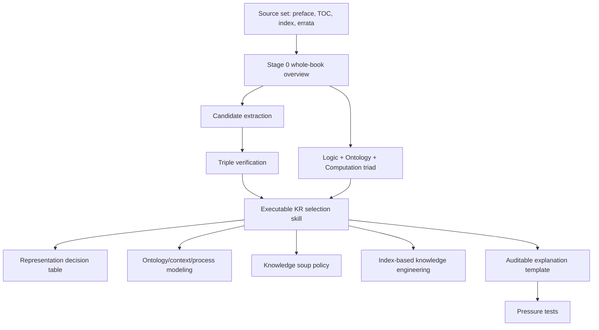

# Index

## Skill

- `SKILL.md`: executable Codex skill for choosing and auditing knowledge representations using Sowa's logic/ontology/computation triad.
- `test-prompts.json`: trigger, non-trigger, and edge-case prompts.
- `audit.json`: source files, chapter counts, method, key concepts, and quality checks.
- `BOOK_OVERVIEW.md`: Adler-style whole-source overview.

## Candidate Audit Files

- `candidates/framework-candidates.md`: decision frameworks and method units considered.
- `candidates/principle-candidates.md`: principles, rules, and checklists extracted.
- `candidates/case-candidates.md`: source-backed examples and application patterns.
- `candidates/counterexample-candidates.md`: failure modes and warning patterns.
- `candidates/glossary-candidates.md`: operational vocabulary for the final skill.

## Rejected Audit Files

- `rejected/rejected-units.md`: candidates that failed triple verification or were merged into broader units.

## Distillation Graph

## Relation To Existing Akzodia Skills

- `07-ontological-engineering`: use when the main task is constructing ontology content and governance.
- `08-knowledge-representation-and-reasoning`: use when the main task is orchestration reasoning behavior.
- `44-knowledge-engineering`: use when the main task is broad knowledge-modeling process and agent communication.
- `47-retrieval-augmented-generation`: use when the main task is source-grounded retrieval and citation behavior.

This skill sits above those as a representation-selection and audit layer.
