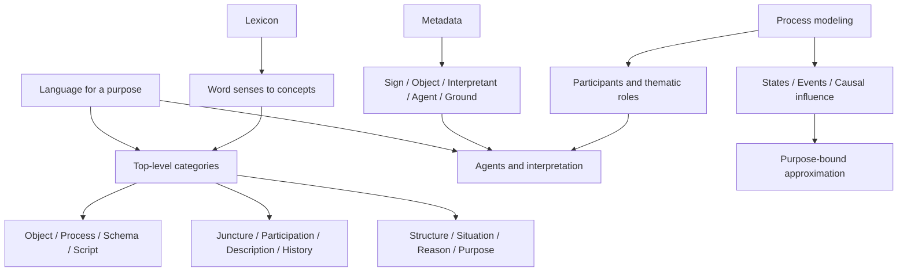

# Book Overview: Sowa Ontology Notes

## Bibliographic Frame

- Title: Ontology
- Author: John F. Sowa
- Source entry: `site-sowa/books/ontology/BOOK.md`
- Local original entry: `site-sowa/ontology/index.htm`
- Distilled output: `Akzodia/skills/50-sowa-ontology-engineering`
- Chapter wrappers: 15
- Primary source form: local mirrored HTML pages with Markdown reading wrappers

## Adler Stage 0

### 1. Structural Understanding

The source is not a single linear monograph. It is a connected set of Sowa ontology pages covering:

- Definition and scope of ontology.
- Agents and levels of agent competence.
- Processes, causality, time, Petri nets, and theory lattices.
- Glossary and metalevel conventions.
- Lexicon structure and semantic representation.
- Ontology, metadata, and semiotics.
- Roles, relations, thematic roles, and participant categories.
- Top-level categories of the KR Ontology.

The engineering center is the interaction among five layers:

1. Top-level categories define the structural backbone.
2. Lexicons connect language-specific signs to semantic concepts.
3. Semiotics explains why metadata must relate signs, objects, agents, and purposes.
4. Processes and causality explain dynamic reality as purpose-bound approximations.
5. Roles and thematic roles explain how entities participate in processes.

### 2. Interpretive Understanding

Sowa's practical method is not "build a complete ontology." It is:

- Start from primitive distinctions.
- Generate a lattice or matrix only where distinctions are meaningful.
- Treat categories as constrained by axioms, not always definable in closed form.
- Keep language, logic, and world knowledge connected through a lexicon.
- Treat metadata as signs interpreted by agents, not meaning in itself.
- Model processes through states, events, participants, preconditions, postconditions, and causal influence.
- Accept that engineering models are approximations for specific purposes.

### 3. Critical Understanding

Strengths:

- Strong safeguards against invalid `is-a` hierarchies.
- Rich tools for separating object, process, sign, role, purpose, script, history, and situation.
- Useful critique of superficial metadata and vocabulary standardization.
- Clear process/causality distinctions for systems engineering and agent modeling.

Risks:

- The full KR ontology is too broad for direct operational use.
- Some primitives are intentionally open and require domain-specific constraints.
- Formal logic, conceptual graphs, and Petri nets are useful but too heavy for many ordinary schema tasks.
- The source pages blend philosophy, linguistics, AI, and engineering; a skill must select executable checks rather than reproduce the theory.

### 4. Application Understanding

The distilled skill should trigger on real modeling work:

- Top-level category audits.
- Lexicon and vocabulary interoperability.
- Semantic metadata review.
- Process, causality, state/event, and workflow modeling.
- Agent, purpose, role, and responsibility modeling.
- Ontology quality review for brittle LLM/agent/task vocabularies.

It should not trigger on generic summaries, philosophy explanations, or simple schema edits.

## Core Concept Map

## Extraction Decision

The material was distilled into one executable Codex skill because the requested output directory and frontmatter name specify a single skill. Candidate subskills were merged into a unified workflow so an agent can audit ontology models end to end without losing cross-links among categories, lexicon, signs, roles, processes, agents, and causality.
