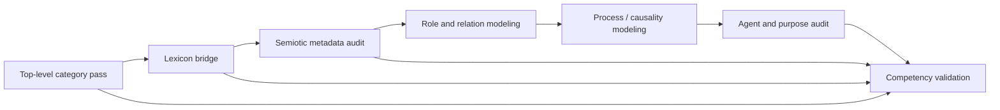

# Index: 50-sowa-ontology-engineering

## Skill

- `SKILL.md`: self-contained executable ontology engineering workflow distilled from Sowa's ontology pages. Runtime use does not require reading the original sources.
- `test-prompts.json`: trigger, non-trigger, and edge-case prompts for skill selection tests, including expected behaviors for independent capability checks.
- `audit.json`: source files, method, concepts, runtime-closure flags, and quality checks.

## Audit Trail

These files preserve source trace and maintenance evidence. They are not required runtime inputs for applying the skill.

- `BOOK_OVERVIEW.md`: Adler-style structural, interpretive, critical, and application overview.
- `candidates/frameworks.md`: framework candidates extracted from the source.
- `candidates/principles.md`: principles and rules candidate pool.
- `candidates/glossary.md`: distilled concept glossary candidate pool.
- `candidates/cases.md`: source examples used as application evidence.
- `candidates/counterexamples.md`: failure patterns and warnings.
- `rejected/rejected-units.md`: units not promoted to the final skill and reasons.

## Conceptual Links

## Use With Nearby Akzodia Skills

- `07-ontological-engineering`: use for general ontology construction in orchestrator/task domains.
- `44-knowledge-engineering`: use for CommonKADS-style knowledge tasks and communication models.
- `08-knowledge-representation-and-reasoning`: use when formal KR notation or reasoning capability is the central issue.

This skill is narrower and deeper around Sowa's specific commitments: top-level categories, lexicon, process/agent/role/causality, semantic metadata, and open-system ontology review.
