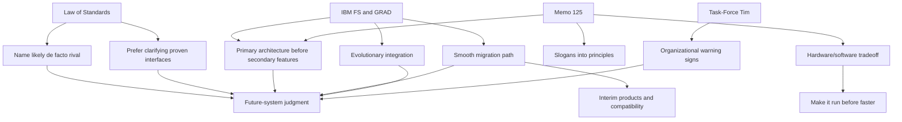

# Index: Sowa Computer Standards And Systems History

## Skill

- `51-sowa-computer-standards-history`: Evaluate standards, future systems, platform APIs, migration plans, and long-term compatibility decisions through Sowa's Law of Standards and IBM FS/Memo 125 constraints.

## Source Map

| Source | Role In Distillation |
|---|---|
| `BOOK.md` | Book wrapper, reading order, source inventory |
| `source-map.json` | Chapter metadata and local HTML mapping |
| `chapters/01-computer-systems.md` and `computer/index.htm` | Frame: FS, HLS, AFS, lost opportunities, Linux/POSIX follow-up |
| `chapters/02-advanced-future-systems.md` and `computer/afs/index.htm` | AFS/HLS history, compatibility alternatives, hardware/software tradeoff |
| `chapters/03-memo-125.md` and `computer/memo125.htm` | Main engineering method: primary architecture, migration, integration, tradeoffs |
| `chapters/04-the-law-of-standards.md` and `computer/standard.htm` | Standards law, proactive standardization failure, de facto alternatives |
| `chapters/05-task-force-tim.md` and `computer/tftim.htm` | Organizational symptom: repeated task forces and reorganization |

## Candidate Units

- `candidates/frameworks.md`: decision frameworks extracted from the source.
- `candidates/principles.md`: rules and checklists extracted from the source.
- `candidates/cases.md`: historical cases used as evidence.
- `candidates/counter-examples.md`: failure patterns and anti-patterns.
- `candidates/glossary.md`: operational definitions.

## Rejected Units

- `rejected/rejected-candidates.md`: candidates that failed cross-source support, predictive power, or non-triviality checks.

## Concept Graph

## Related Local Skills

- `03-systems-engineering`: use when the review needs requirements, lifecycle, verification, validation, and interface traceability beyond standards adoption.
- `28-data-intensive-applications`: use when the disputed standard is a data system, storage model, query interface, or descriptor schema.
- `30-site-reliability-engineering`: use when compatibility and migration risk affect production operations.
- `43-monitoring-and-observability`: use when runtime feedback is needed so expert users can understand system behavior.
